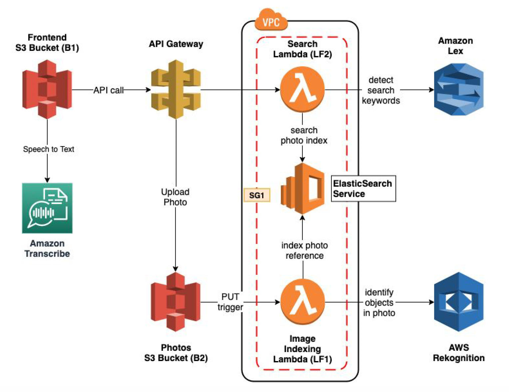
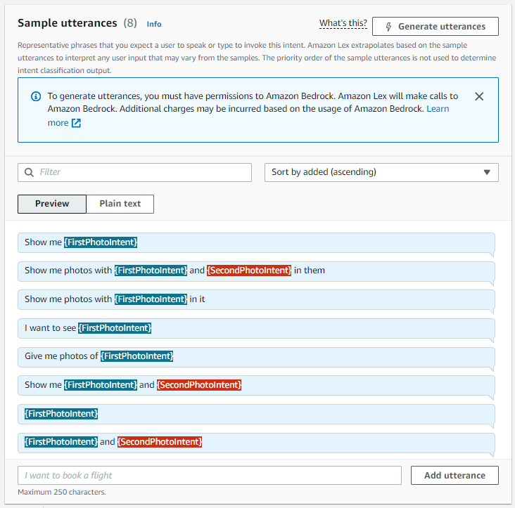
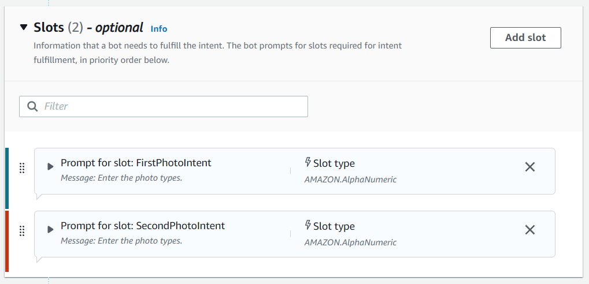
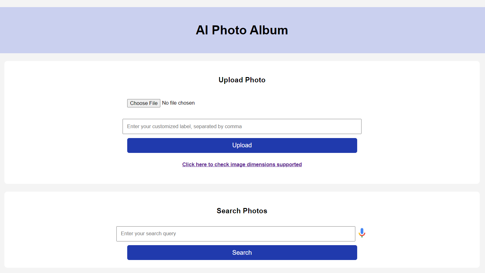
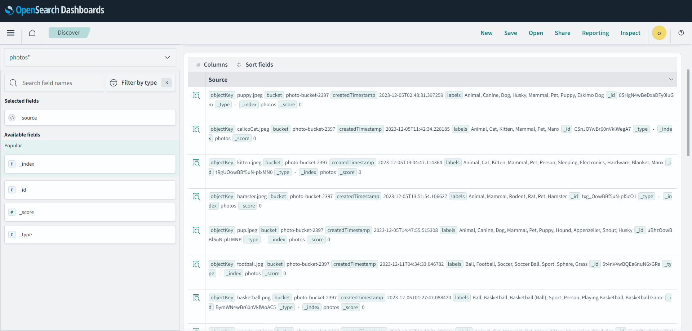
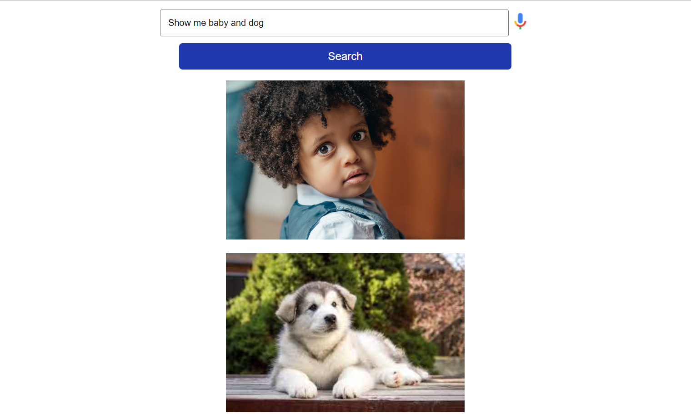

# Photo Album with Natural Language Searching
Project Link: [AI Photo Album Website](http://photo-album-webpage.s3-website-us-east-1.amazonaws.com/)

## About The Project
This is a photo album web application, that can be searched using natural language through both text and voice. Everytime users upload a photo, features and labels inside the photo will be detected and stored. When the user later search these labels in this album, relevant photos with corresponding features will come up.

### Built With
This project mainly used services provided by AWS.

1. [S3](https://aws.amazon.com/s3/)
2. [API Gateway](https://aws.amazon.com/api-gateway/)
3. [Lambda](https://aws.amazon.com/lambda/)
4. [Lex](https://aws.amazon.com/lex/)
5. [OpenSearch](https://aws.amazon.com/opensearch-service/)
6. [Rekognition](https://aws.amazon.com/rekognition/)

(<a href="#readme-top">back to top</a>)

### Project Architechture Diagram

(<a href="#readme-top">back to top</a>)

### Natural Language Searching
The function of photo searching via natural language is implemented with Amazon Lex.

Here're the steps:

1. Create a Lex bot in AWS console (Using Lex V2 is highly recommended)
2. Create an intent in the bot
3. Add training utterances to the intent, such that the bot can pick up both keyword searches (“trees”, “birds”), as well as sentence searches (“show me trees”, “show me photos with trees and birds in them”). Use two slots 'FirstPhotoIntent' and 'SecondPhotoIntent' to capture the keywords entered by users. 
4. Check the option 'Required for this intent' for the first slot only.

  

  Lex Utterances

  

  Slots

## Usage
1. Check the image restriction of Rekognition. Make sure your images is supported by Rekognition.
2. Choose the photo you want to upload and add custom labels if you want. Click 'upload' to upload.
3. After the photo is uploaded, Rekognition will analyze it and generate labels for it. The labels of photos are stored in the OpenSearch index.
4. Query photos according to utterances in Lex bot. Results will apear at the bottom.
##### Video Demo: [https://youtu.be/Xep-HgO3IYk](https://youtu.be/Xep-HgO3IYk "Video Demo")

  Album Interface

  Labels of Photos

  Query Example

(<a href="#readme-top">back to top</a>)

## AWS CodePipeline Implementation Steps
### Lambda Functions:
##### Step 1: Choose pipeline settings

##### Step 2: Add source stage
In this step, I choose GitHub as the source. The purpose is that every time I push a new commit to my GitHub repository, it will trigger the pipeline to build and deploy my new commit.

 
 
After choosing Github (V2) as the source, the settings will guide developers to connect with their GitHub repository. The settings is shown as below.

##### Step 3: Add build stage
Select CodeBuild as the Build provider. If you haven't created any build project for this pipeline, click 'Create project'. For the build project creation, I choose Managed Image, EC2, Ubuntu, New Service Role and 'Use a buildspec file'. Remember to add permission of accessing lambda service to the new service role. 

Moreoevr, the correctness of buildspec.yml file is important to the success of the build stage. 
In my buildcpec.yml, I separately packaged the dependencies and code for lambda function 1 (line 18) and lambda function 2 (line 19) and write the command of updating my lambda functions in AWS console (line 24, 25).

After the creation finished, we return to the page of step 3 and choose the poject name that we just created.

##### Step 4: Add deploy stage
In this step, I choose S3 as the deploy provider. Before continuing, create a S3 bucket and select this bucket in this stage. The S3 bucket will be used to store files from your GitHub repository.

##### Testing
After the above steps are finished, you should be able to see the stage of source, build and deploy succeed after you push a commit to the repository selected in step 2.

(<a href="#readme-top">back to top</a>)

<!-- CONTRIBUTING -->
## Contributing

Contributions are what make the open source community such an amazing place to learn, inspire, and create. Any contributions you make are **greatly appreciated**.

If you have a suggestion that would make this better, please fork the repo and create a pull request. You can also simply open an issue with the tag "enhancement".
Don't forget to give the project a star! Thanks again!

1. Fork the Project
2. Create your Feature Branch (`git checkout -b feature/AmazingFeature`)
3. Commit your Changes (`git commit -m 'Add some AmazingFeature'`)
4. Push to the Branch (`git push origin feature/AmazingFeature`)
5. Open a Pull Request

(<a href="#readme-top">back to top</a>)

<!-- CONTACT -->
## Contact

Letian Jiang (Email: lj2397@nyu.edu)

Shihui Huang (Email: sh4480@nyu.edu)

(<a href="#readme-top">back to top</a>)

<!-- ACKNOWLEDGMENTS -->
## Acknowledgments

The following recourses helped me to complete this project.

* [AWS Doc](https://docs.aws.amazon.com/)
* [Former2](https://github.com/iann0036/former2)

(<a href="#readme-top">back to top</a>)

