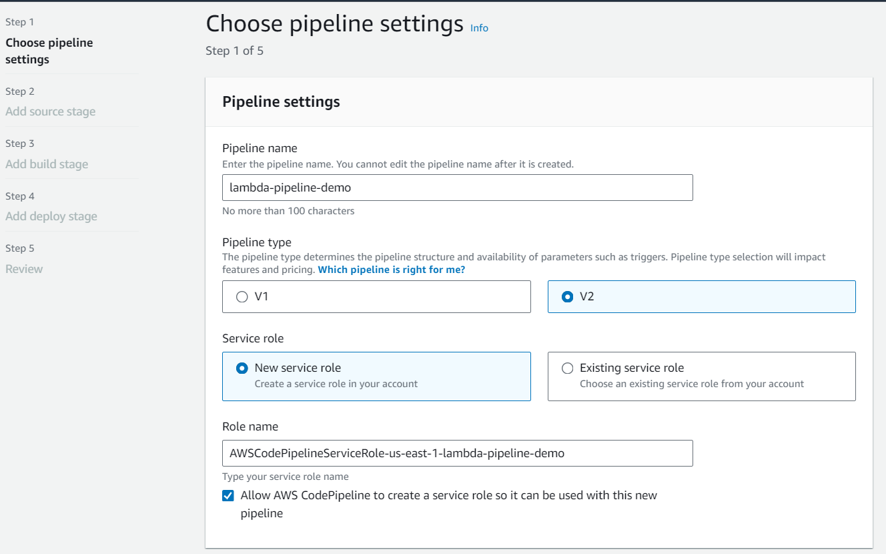
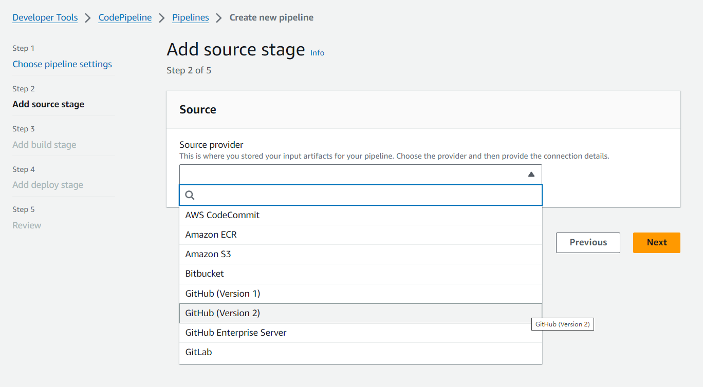
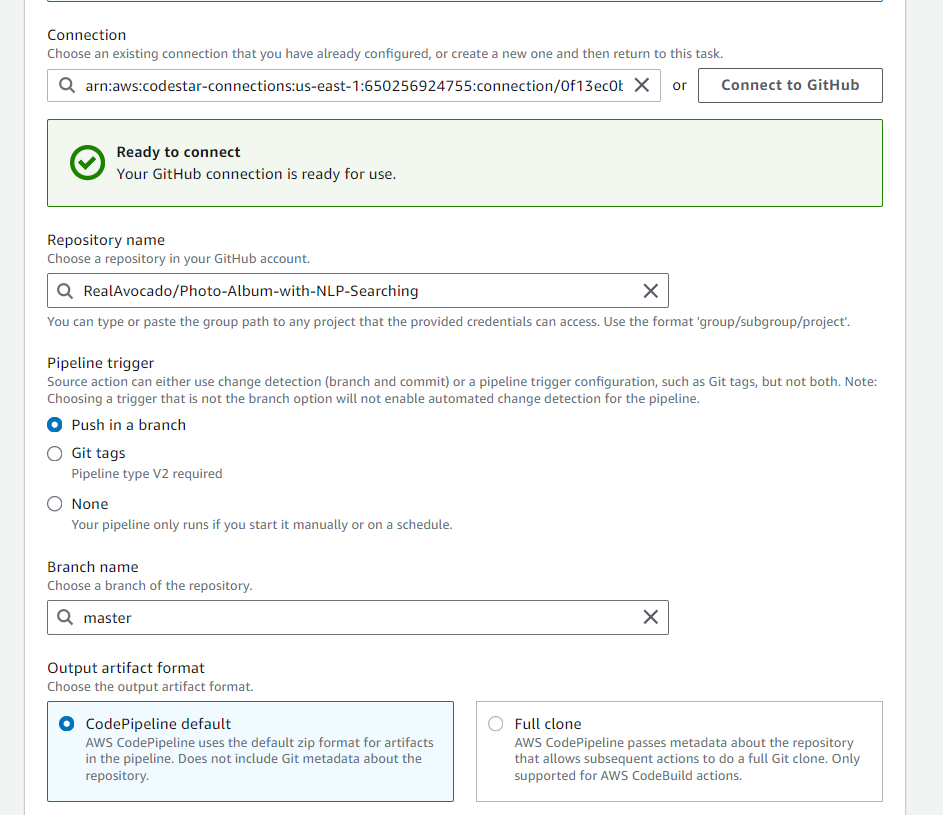
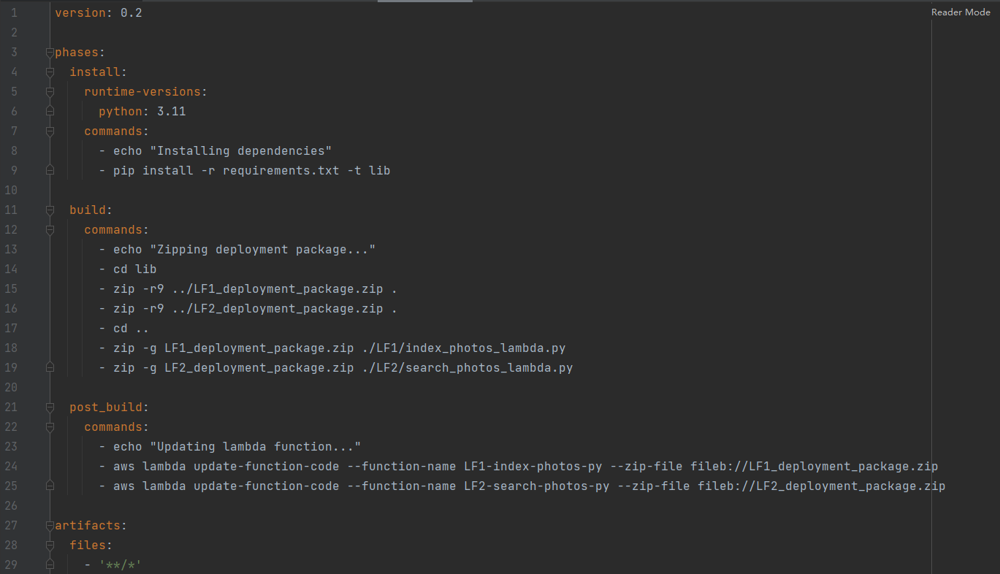
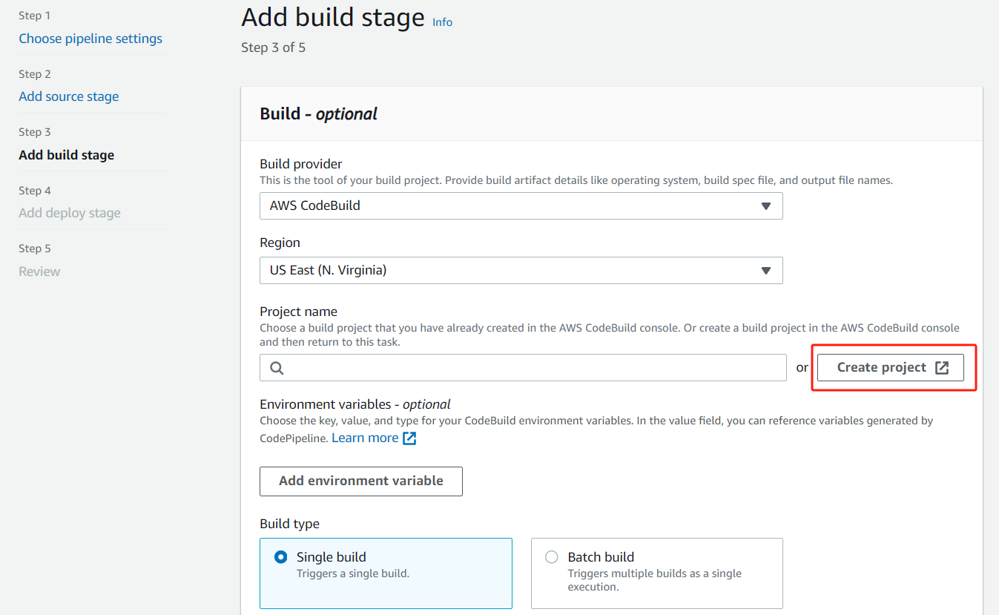
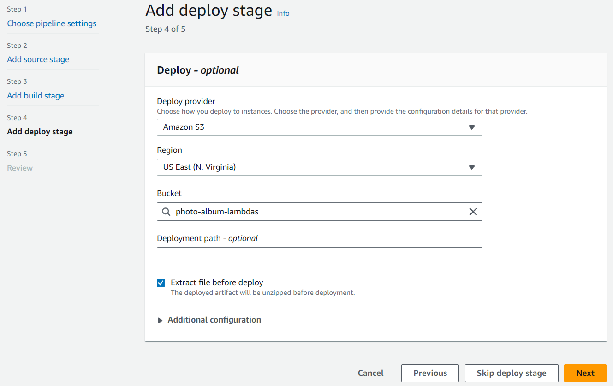
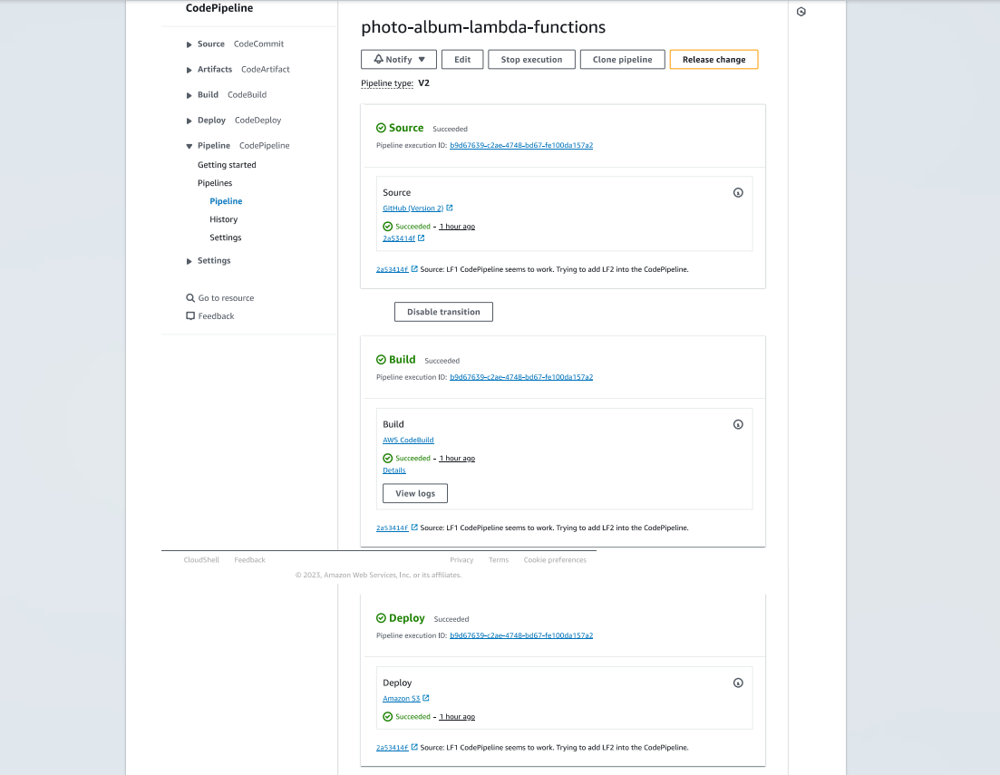

# Photo Album with NLP Searching
## AWS CodePipeline Implementation Steps
### Lambda Functions:
##### Step 1: Choose pipeline settings

##### Step 2: Add source stage
In this step, I choose GitHub as the source. The purpose is that every time I push a new commit to my GitHub repository, it will trigger the pipeline to build and deploy my new commit.

 
 
After choosing Github (V2) as the source, the settings will guide developers to connect with their GitHub repository. The settings is shown as below.

##### Step 3: Add build stage
Select CodeBuild as the Build provider. If you haven't created any build project for this pipeline, click 'Create project'. For the build project creation, I choose Managed Image, EC2, Ubuntu, New Service Role and 'Use a buildspec file'. Remember to add permission of accessing lambda service to the new service role. 

Moreoevr, the correctness of buildspec.yml file is important to the success of the build stage. 
In my buildcpec.yml, I separately packaged the dependencies and code for lambda function 1 (line 18) and lambda function 2 (line 19) and write the command of updating my lambda functions in AWS console (line 24, 25).

After the creation finished, we return to the page of step 3 and choose the poject name that we just created.

##### Step 4: Add deploy stage
In this step, I choose S3 as the deploy provider. Before continuing, create a S3 bucket and select this bucket in this stage. The S3 bucket will be used to store files from your GitHub repository.

##### Testing
After the above steps are finished, you should be able to see the stage of source, build and deploy succeed after you push a commit to the repository selected in step 2.
